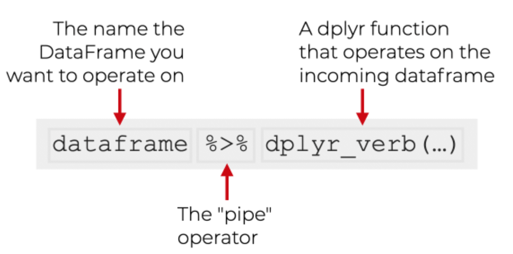
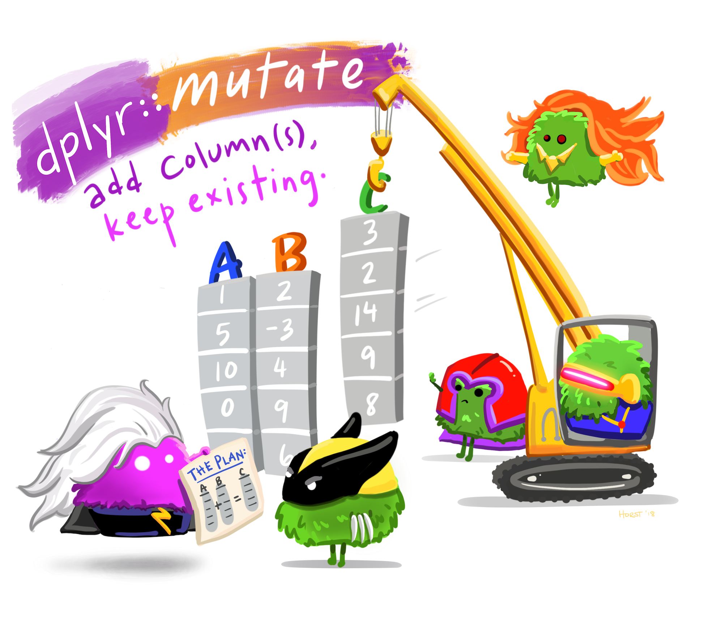
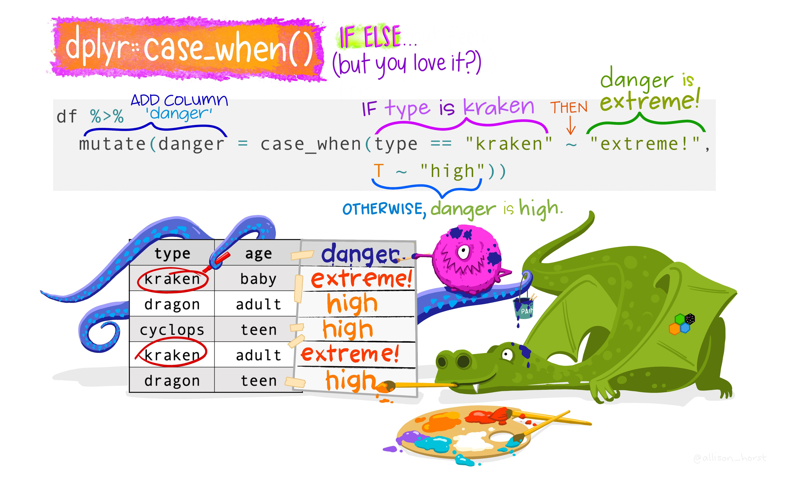

class: center middle

```{r setup, include=FALSE}
options(htmltools.dir.version = FALSE)
```

### Before I forget..

---

## R is Case Sensitive.

.center[]

---

## Which is better?

- Matter of personal choice... But...

.center[]
---


class: inverse middle

# Outline of the talk

- What is EDA?

- Generate questions about your data.

- Search for answers by visualising, transforming your data.

- Live Demo Session


---


# What is EDA?

### Exploratory Data Analysis


.pull-left[
- **EDA** is the critical first step.

- **EDA** is a state of mind. 

- **EDA** is exploring your ideas.

- **EDA** has no strict rules.

- **EDA** helps understand your data.

- **EDA** is an iterative cycle.

- **EDA** is a creative process.


]

.pull-right[

]

---
class: middle

# What is EDA?

It  is  mostly  a  **philosophy**  of  data analysis where the researcher examines the data without any pre-conceived ideas  in  order  to  discover what  the  data  can  tell  him  or  her  about the phenomena  being  studied.  

.left[*"detective work – numerical detective work – or counting detective work – or graphical detective  work"*]

.right[— **Tukey,  1977** *Page 1, Exploratory Data Analysis*]

---

# Questions

The easiest way to do **EDA** is to use questions as tools to guide your investigation. **EDA** is an important part of any data analysis, even if the questions are known already.


.left[*"There are no routine statistical questions, only questionable statistical routines."*]

.right[— **Sir David Cox**]


.left[*"Far better an approximate answer to the right question, which is often vague, than an exact answer to the wrong question, which can always be made precise."*]

.right[— **John Tukey**]


---
class: middle

# Asking the right questions

Key to asking **_quality_** questions is to generate a large **_quantity_** of questions.

It is difficult to ask revealing questions at the start of the analysis.

But, each new question will expose a new aspect and increase your chance of making a discovery.

### Questions to ask:


- What type of variation occurs within your variables?

- What type of covariation occurs between your variables?

- Whether your data meets your expectations or not. 

- Whether the quality of your data is robust or not.

---
# The process of EDA

.center[]
1. Import
2. Tidy
3. Explore
  - Transform
  - Visualize
  - Transform
  - Visualize
  - Transform 
  - Visualise ...
  - ... 
  
**It is an iterative process**
---

class: inverse 

# What did we cover yesterday?

### Concepts

- Health Data Science
- Reproducible Research
- Tidy Data 

### How to Visualize Data
- `ggplot2`

### How to Import Data
- `readr`
- `readxl`
- `here::here()` 

---

class: middle

# What will be covered today?

### Preparing Tidy Data
- Data Cleaning
- Data Wrangling

### Data Exploration
- Data Transformation
- Data Visualization

### Statistical Analysis
### Summary Tables

---

class:  middle

# Before we get started

### To recap what we learnt in the previous sessions.. 

We now know to work within the R Project environment. 


`here::here()` makes it easy for us to manage file paths. 

You can quickly have a look at your data using the `View()` and `glimpse()` functions. 


Most of the tidy data is read as `tibble` which is a workhorse of `tidyverse`.

---

# Getting Started with the Data Exploration Pipeline

## Step Zero: Get your documents and data in place.

- Today we will be working in a RMarkdown Document (`.Rmd`). 

- RMarkdown interweaves prose with code. 

- Please download the `.Rmd` file provided to you via email and place it in the working directory.

- We will work from within yesterday's project.

-  Yes, `here::here()`!


---

class: inverse middle

# Today, we will be introducing you to three new packages:

1. `dplyr`

2. `skimr`

3. `DataExplorer`


---


## `dplyr` Package

.left[
The `dplyr` is a powerful R-package to manipulate, clean and summarize unstructured data. In short, it makes data exploration and data manipulation easy and fast in R. 
]

.right[


]
---

# Verbs of the `dplyr`

There are many verbs in `dplyr` that are useful.

.center[]

---
# Syntax of the `dplyr` verbs


---


# Getting used to the pipe ` %>% `

### The pipe operator in `dplyr`

The pipe `%>%` means **THEN**...


The pipe is an operator in R that allows you to chain together functions in `dplyr`.
---


## Lets load some sample data

```{r include=FALSE}
options(tidyverse.quiet = TRUE)
library(tidyverse)
library(here)
```


```{r glimpse-data, eval=FALSE}

tb <- read_csv(here("who_tubercolosis_data.csv"))

glimpse(tb)

```


```{r ref.label="glimpse-data", echo=FALSE, message=FALSE, warning=FALSE, out.width="100%"}
```


---


# Let's look at the `head()` 

```{r head-data, eval=FALSE}

head(tb)

```


```{r ref.label="head-data", echo=FALSE, message=FALSE, warning=FALSE, out.width="100%"}

```

---


# Let's look at the `names()` 

```{r names-data, eval=FALSE}

dim(tb)


names(tb)

```


```{r ref.label="names-data", echo=FALSE, message=FALSE, warning=FALSE, out.width="100%"}

```


---


## Let's look at the different countries

### Find the unique countries in the bottom 50 rows of tb.

```{r country-names-data, eval=FALSE}
# without the pipe
unique(tail(tb, n = 50)$country)

# with the pipe
tb %>% 
  tail(50) %>%
  distinct(country)

```


```{r ref.label="country-names-data", echo=FALSE, message=FALSE, warning=FALSE, out.width="100%"}

```


---

### Find the unique countries in the bottom 50 rows of `tb`

You will notice that we used different functions to complete our task. 


The code without the pipe uses functions from base R while the code with the pipe uses a mixture (`tail()` from base R and `distinct()` from `dplyr`).

Not all functions work with the pipe, but we will usually opt for those that do when we have a choice. 


---
class: middle 

##  `distinct()` and `count()`

The `distinct()` function will return the distinct values of a column, while `count()` provides both the distinct values of a column and then number of times each value shows up. 


.pull-left[
```{r distinct-data, eval=FALSE}
tb %>% 
  distinct(who_region) 
```


```{r ref.label="distinct-data", echo=FALSE, message=FALSE, warning=FALSE, out.width="100%"}

```

]

.pull-right[
```{r count-data, eval=FALSE}

tb %>% 
  count(who_region)

```


```{r ref.label="count-data", echo=FALSE, message=FALSE, warning=FALSE, out.width="100%"}

```


]

Notice that there is a new column produced by the count function called `n`.


---

class:middle

##  `arrange()`

The `arrange()` function does what it sounds like. It takes a data frame or tbl and arranges (or sorts) by column(s) of interest. 

The first argument is the data, and subsequent arguments are columns to sort on.

Use the `desc()` function to arrange by descending.

.pull-left[
```{r arrange-data, eval=FALSE}
tb %>% 
  count(who_region) %>% 
  arrange(n)
```


```{r ref.label="arrange-data", echo=FALSE, message=FALSE, warning=FALSE, out.width="100%"}

```

]

.pull-right[
```{r desc-data, eval=FALSE}

tb %>% 
  count(who_region) %>% 
  arrange(desc(n)) # use can also use  arrange(-n)


```


```{r ref.label="desc-data", echo=FALSE, message=FALSE, warning=FALSE, out.width="100%"}

```


]


##  `filter()`

If you want to return **rows** of the data where some criteria are met, use the `filter()` function.

This is how we subset in the tidyverse. (Base R function is `subset()`)


---


## Logical Operators

Here are the logical criteria in R:

<style>
div.blue { background-color:#e6f0ff; border-radius: 5px; padding: 20px;}
</style>
<div class = "blue">

- `==`: *Equal to*
- `! =`: *Not equal to*
- `>`: *Greater than*
- `> =`: *Greater than or equal to*
- `< `: *Less than*
- `< =`: *Less than or equal to*

<ul>
  <li>`==`: Equal to</li>
  <li>`! =`: Not Equal to</li>
  <li>`>`: Greater than</li>
</ul>


</div>


If you want to satisfy *all* of multiple conditions, you can use the "and" operator, `&`. 

The "or" operator `|` (the vertical pipe character, shift-backslash) will return a subset that meet *any* of the conditions.


---

class: middle

## Filter 2015 and above

```{r filter-data, eval=FALSE}
tb %>% 
  filter(year >= 2015) 
```


```{r ref.label="filter-data", echo=FALSE, message=FALSE, warning=FALSE, out.width="100%"}

```

---


class: middle

## Filter India

```{r filter-india-data, eval=FALSE}

tb %>% 
  filter(country == "India") 


```


```{r ref.label="filter-india-data", echo=FALSE, message=FALSE, warning=FALSE, out.width="100%"}

```


---


# Both India and 2015 or more recent

```{r filter-and-india-data, eval=FALSE}

tb %>% 
  filter(year >= 2015 & country == "India")
```


```{r ref.label="filter-and-india-data", echo=FALSE, message=FALSE, warning=FALSE, out.width="100%"}

```


---


## `%in%` function

To `filter()` a categorical variable for only certain levels, we can use the `%in%` operator.

Let's see data from India, Nepal, Pakistan and Bangladesh First we will have to figure out how those are spelled in this dataset. 

Open the spreadsheet viewer and find out. 

We'll see a way to find them in code later on in the course.


---

## Indian Subcontinent


```{r filter-indian, eval = F}
indian_subcont <- c("India",
           "Nepal",
           "Pakistan",
           "Bangladesh")

tb %>% filter(country %in% indian_subcont)

```


```{r ref.label="filter-indian", echo=FALSE, message=FALSE, warning=FALSE, out.width="100%"}

```


---


##  Other Useful Functions


## `drop_na()`

The `drop_na()` function is extremely useful for when we need to subset a variable to remove missing values.


## `select()`

Whereas the `filter()` function allows you to return only certain _rows_ matching a condition, the `select()` function returns only certain _columns_. The first argument is the data, and subsequent arguments are the columns you want.


---


## `summarize()`

The `summarize()` function summarizes multiple values to a single value.

On its own the `summarize()` function doesn't seem to be all that useful. 

The dplyr package provides a few convenience functions called `n()` and `n_distinct()` that tell you the number of observations or the number of distinct values of a particular variable.


`summarize()` is the same as `summarise()`

```{r summarisenames-data, eval=FALSE}
tb %>% 
  summarize(hiv_percent = mean(hiv_percent, na.rm = TRUE))

```


```{r ref.label="summarisenames-data", echo=FALSE, message=FALSE, warning=FALSE, out.width="100%"}

```


---


## `group_by()`

We saw that `summarize()` isn't that useful on its own. Neither is `group_by()`. 

All this does is takes an existing data frame and converts it into a grouped data frame where operations are performed by group.


```{r group1-data, eval=FALSE}
tb %>% 
  group_by(year)

```


```{r ref.label="group1-data", echo=FALSE, message=FALSE, warning=FALSE, out.width="100%"}

```


---

## Two variable `group_by()`

```{r group2-data, eval=FALSE}

tb %>% 
  group_by(year, who_region)


```


```{r ref.label="group2-data", echo=FALSE, message=FALSE, warning=FALSE, out.width="100%"}

```


---


## `group_by()` and `summarize()` together

The real power comes in where `group_by()` and `summarize()` are used together. First, write the `group_by()` statement. Then pipe the result to a call to `summarize()`.

```{r group3-data, eval=FALSE}
tb %>% 
  group_by(year) %>% 
  summarize(mean_inc = mean(incidence_100k, na.rm = TRUE))
```


```{r ref.label="group3-data", echo=FALSE, message=FALSE, warning=FALSE, out.width="100%"}

```


---


## `mutate()`

Mutate creates a new variable or modifies an existing one.




---

## `ifelse()`

Lets create a column called `ind_sub` if the country is in the Indian Subcontinent.


```{r ifelse-data, eval=FALSE}

tb %>% 
  mutate(indian_sub1 = ifelse(country %in% indian_subcont, 
                              "Indian Subcontinent", "Others"))

```


```{r ref.label="ifelse-data", echo=FALSE, message=FALSE, warning=FALSE, out.width="100%"}

```


---


## `case_when()`

Alternative of `ifelse()`




---
class: middle

# `ifelse()` vs `case_when()`

Note that the `if_else()` function may result in slightly shorter code if you only need to code for 2 options. 

For more options, nested `if_else()` statements become hard to read and could result in mismatched parentheses so `case_when()` will be a more elegant solution.


---


# More Resources for `dplyr`


- Check out the [Data Wrangling Cheatsheet](https://rstudio.com/wp-content/uploads/2015/02/data-wrangling-cheatsheet.pdf) that covers dplyr and tidyr functions. 

- Review the [Tibbles](https://r4ds.had.co.nz/tibbles.html) chapter of the excellent, free [**_R for Data Science_ book**](http://r4ds.had.co.nz).

- Check out the [Transformations](https://r4ds.had.co.nz/transform.html) chapter to learn more about the `dplyr` package. Note that this chapter also uses the graphing package `ggplot2` which we have covered yesterday.


---


# `skimr` Package

`skimr` is designed to provide summary statistics about variables in data frames, tibbles, data tables and vectors. 

The core function of `skimr` is the `skim()` function, which is designed to work with (grouped) data frames, and will try coerce other objects to data frames if possible. 

---


# `DataExplorer` Package

The `DataExplorer` package aims to automate most of data handling and visualization, so that users could focus on studying the data and extracting insights.^[[DataExplorer Package](https://boxuancui.github.io/DataExplorer/)]

The single most important function from the `DataExplorer` package is `create_report()`

---


class: middle center hide-logo

# Lets Begin!


